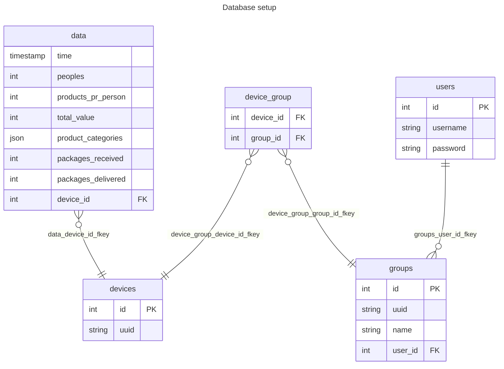

```mermaid
---
title: Database setup
---
erDiagram
    data {
        timestamp time
        int peoples
        int products_pr_person
        int total_value
        json product_categories
        int packages_received
        int packages_delivered
        int device_id FK
    }
    devices {
        int id PK
        string uuid
    }
    groups {
        int id PK
        string uuid
        string name
        int user_id FK
    }
    device_group {
        int device_id FK
        int group_id FK
    }
    users {
        int id PK
        string username
        string password
    }

    users ||--o{ groups : groups_user_id_fkey
    device_group }o--|| groups : device_group_group_id_fkey
    device_group }o--|| devices : device_group_device_id_fkey
    data }o--|| devices : data_device_id_fkey
```
