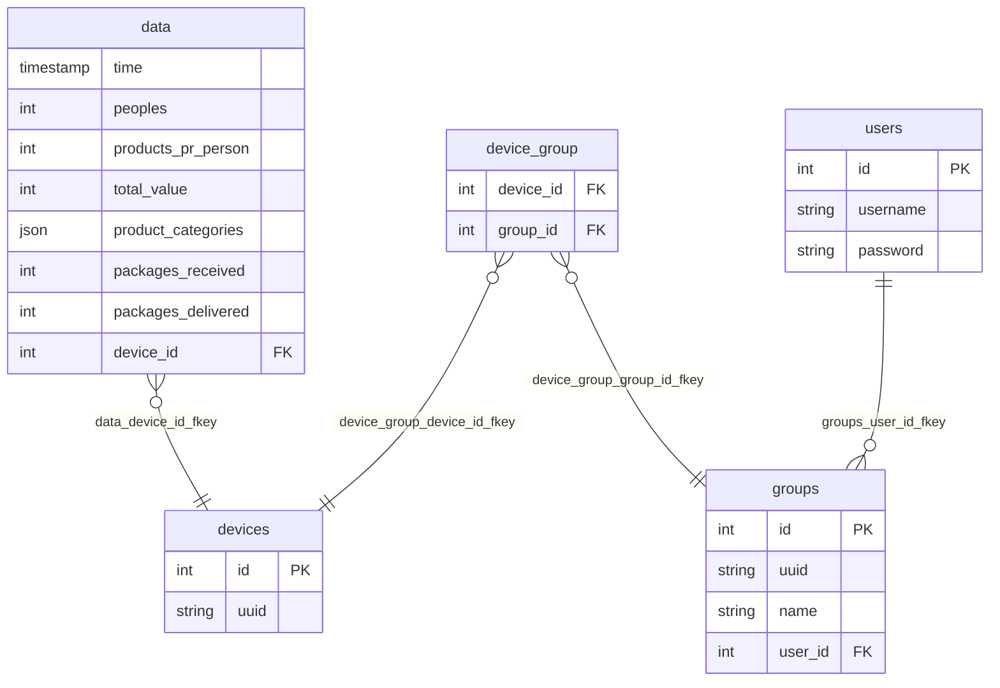

**Title**: StoreMetrics

**Participants**: Kasper R, Kasper K & Jonas N.

# Specs

1. **Project Description:**
    We want to create a system to collect data from physical stores. The data we are interested in collecting are:
    - How many people have entered the store
    - How many products have been sold
    - What types of products have been sold
    - The total value of sold products
    - How many packages have been picked up and delivered to the store if the store has a package delivery spot

    The purpose is to collect data from stores and display it in an intuitive way where a user can filter and search the data.

2. **Domain Model:**
    - IoT devices: Collect data continuously and send it every minute.
    - Server: Runs an nginx web server that directs traffic to a backend written in PHP using the Laravel framework.
    - Backend: Receives data through a message broker and stores it in a MariaDB SQL server.
    - Frontend: Uses Laravel blade templates to display data.
    ```mermaid
    graph LR;
    E[Frontend] --- C
    A[IoT]-->B[Message broker]
    B-->C[Backend]
    C-->D[(Database)]
    A-- HTTP One time (on startup) ---C
    ```

3. **Functional Requirements:**
    - IoT devices must display an ID on a display, which can be used to filter the data.
    - IoT devices must only use HTTP for the initial communication to get a UUID.
    - IoT devices must be able to collect and send data continuously.
    - The server must be able to receive and store data from IoT devices.
    - The frontend must be able to display the collected data.
    - The frontend must have an admin page:
        - Login + logout.
        - Where you can group devices as a single unit.
        - Manage grouped devices.
    - Data display must include filtering and searching options.
    - All data must be accessible to everyone.
    - CI/CD Deployment.

4. **Non-functional Requirements:**
    - Usability: The user interface must be intuitive and easy to navigate.
    - Reliability: The system must have an uptime of 99.9%.
    - Performance: The system must handle up to 1000 concurrent devices.
    - Supportability: The code must be well-documented and easy to maintain.

5. **Limitations:**
    - Data predictions
    - Data pagination
    - Data export to csv

# Database


# User guide

The guide is designed for <https://krc-coding.dk>

**as a user you can:** 

**Get all data:**

just click the "Search" button with the text field empty. (might not currently work as there is to much data) 

**Get data from a specific device:**

if you want to get data from a specific device (normaly your own device) you will have to type in the UUID of the device before clicking search. 

(device UUID's are displayed on the device screen)

here are some device UUID's you can try:

- 63ea5a6f-506d-36e2-a711-3d96e1fc8b7b
- 0612383f-4d7e-36a2-a501-3e104209f0b4
- 46b2c477-91ec-34f4-aba0-acb4f1c4d48f

**Sort the data:**

after fetching some data just click on the colum header that you want the data sorted by, first click will sort in decenting order (biggest number first) and the second ascending. (smallest number first)

**Signup/Login:**

just click the "Login" button in the top right corner and login.

if you dont already have an account click the signup button and create one.

**User profile:**

once logged in the login button will be replaced by a button that will lead you to your profile.

**Create a group:**

on the profile page just type a name into the text field and click the "Create Group" button.
after a group is created you now have a row that states the name of the group, what devices are in it, some actions you can take and the Group UUID

(this makes it so that you can get data from multiple devices at the same time without having to get all data)

**Add device to group:**

to add a device to a group you need to type in the UUID of the device into the text field in the "Action" collum,
in the row of the group you want to add it to and click the "Add Device" button.

(you can see the UUID's of devices thats in the group undet the collum "Devices")

here are some device UUID's you can try:

- 63ea5a6f-506d-36e2-a711-3d96e1fc8b7b
- 0612383f-4d7e-36a2-a501-3e104209f0b4
- 46b2c477-91ec-34f4-aba0-acb4f1c4d48f

**Remove device from group:**

simply finde the device you wonna Remove on the Device list and click remove you will then be prompted it you are sure clicking ok will remove it.

(removed devices can be added back later so dont worry to much about accidently removing one)

**Delete Group:**

under the "Actions" collum click the "Delete Group" button you will then be prompted if you are sure.

(this will permanently delete the group so if you want the group back you will have to create a new one)

**Get group data:**

now if you go back to the search page (button in the top left corner) and put in your group uuid it before clicking search you will now get the data from all devices in the group.

(you dont need to be logged in to use the group UUID's)

if you deleted your group you can use mine:

- 68ed957b-c465-401e-9899-5977275bdcc0

**Logout:**

to log out go the your profile page and click the "Logout" button in the top right corner.

(this will automaticly send you back to the search page)


# Dev setup guide

### **Requirements**
- php 8.3.x NTS (Not Thread Safe)
- Composer
- MariaDB

## **Setup**
1. **Git clone**
    - Clone the project down on your machine

2. **Install/update composer in project**
    - Using a terminal to navigate to the project and go into /StoreDataCollection 
    - Run: `composer install`

3. **Env**
    - In terminal run both: 
        * `cp .env.example .env`
        * `php artisan key:generate`
    - Update your DB settings to fit your database

4. **Database**
    - Create a new database with the same name as you used in your env
    - In the terminal run: `php artisan migrate`

5. **Run degub**
    - Run: `php artisan serve` 

## Debugging
### Frontend
You can debug by going to localhost:8000

### Backend
You need to send http request.
We recommend using postman, as we have an collection in the files called: H5.postman_collection.json

## Integration testing
Backend as an integration test setuped.

* __This is not necessary__. In testing we can use another db if we don't want to use our live:
    * In terminal run: `cp .env.testing.example .env.testing`
    * Update the db settings and copy APP_KEY from .env
    * Create the db on your db
    * Run: `php artisan migrate --env=testing`

* To try it run: `php artisan test`

# Arduino setup guide (IoT device)

All Arduino related code can be found inside the Arduino folder.  
All commands and info assumes that you've opened the Arduino folder.

## Requirements:

Board type: `Arduino MKR WiFi 1010`

Libraries to install for arduino code to function:

- Arduino_MKRIoTCarrier by Arduino
- WiFiNINA by Arduino
- NTPClient by Fabrice Weinberg
- ArduinoHttpClient by Arduino
- PubSubClient by Nick O'Leary
- ArduinoJson by Benoit Blanchon

## Before upload:

1. Copy SECRETS.h.example to SECRETS.h: `cp SECRETS.h.example SECRETS.h` 
2. Add your wifi info, if you're hosting the backend from a local pc, then the arduino should be on the same wifi.
3. Add the ip of the backend to the server host variable.
4. If the port of the backend is different from 8000, then update the server port variable as well.

## After upload:

The arduino should now begin to connect to the required services.  
If it fails to connect to the mqtt host, then it will display it on the primary display of the device.

To get the messages sent to the mqtt host into the database:

1. Open a new terminal on the pc/server running the backend.
2. Navigate in to the folder containing the backend code. `StoreDataCollection`
3. Run the following artisan command: `php artisan rabbitmq:consume`

This will start a process that will continue to listen for messages on the rabbitmq server.  
To stop it from listening, simply stop the command.

---

# Logbooks:

## Jonas N:
17-19/03/2025
- planlægning af project.

20/03
- created home page.

21/03
- sick.

24/03
- fixed connection proplems to my vpn and made home page able to recieve data.

25/03
- Made styling for home page.

26/03
- finished the design for the home page and added a login modal.

27/03
- changed login and sign-up modal into components.

28/03
- added sorting to the data.

31/03
- started on making the admin page.

01/04
- created group manipulation options. (CROD)

02/04
- added logout and home(Data Search) buttons and finished the design.

03/04
- fixed bugs and looked at PR's on git.

04/04
- added a security layer so the user wont accidently delete their groups or devices
- and made it so they cant dublicate devices in a group. (only frontend)

07/04
- started up on writing a user guide.

08/04
- finished writing the user guide.

09/04
- made the user guide more readable.

## Kasper K:
20-3-25
- Made migrations
- Made crud to data controller

21-3-25
- Updated migrations spelling mistake
- Made crud to device controller

24-3-25
- Made crud to user controller

25-3-25
- Finished making user controller
- Made access token migrations

26-3-25
- Made group controller

27-3-25
- Made a search api
- Made an api for arduino

28-3-25
- Made integration testing for api

31-3-25
- Continues making integration test

1-4-25
- Search returns data instead of devices or group

2-4-25
- Got my thing merge and fixed the small errors coming from it

3-4-25
- Sick

4-4-25
- Half sick
- Code comments

7-4-25 -> 9-4-25
- Documentation


## Kasper R:

17-03-2025:
- Planning on what the project should be. (group)

18-03-2025:
- Continued planning and writing the initial case definition and specs. (group)
- Configured server access for group. (group)

19-03-2025:
- Finalized initial planning. (group)
- Collected some relevant retail data, to use for generating random data. 
- Created initial laravel project for backend.

20-03-2025:
- Looked into how to convert markdown files into pdf files.
- Looked into converting mermaid diagrams into images as they didn't convert nicely in pdf.

21-03-2025:
- Successfully converted a mermaid diagram into a png, and converted it into a pdf file.
- Helped setting up backend project on Kaspers local machine.
- Helped with initial structure of backend models and database setup.

24-03-2025:
- Setup web server.
- Debugging why webserver didn't work.

25-03-2025:
- Setup web server.
- Debugging why webserver didn't work.

26-03-2025:
- Created auto deploy script for web server.

27-03-2025:
- Working on initial code for arduino, based on earlier projects. (initial copy of relevant code)

28-03-2025:
- Working on initial code for arduino, based on earlier projects. (code cleanup)

31-03-2025:
- Continued code cleanup of arduino code, and begang working on conencting arduino to server. 

01-04-2025:
- Setup connection between arduino and server for uuid verification/registering device.

02-04-2025:
- Finalized connection between arduino and server, for uuid verification/registration.
- Saved uuid id to file to function across restarts of device.

03-04-2025:
- Setup random data generation on arduino.
- Started working arduino - rabbitmq connection over mqtt protocol.

04-04-2025:
- Finalized arduino - rabbitmq connection.
- Setup rabbitmq - laravel connection using laravel artisan command.

07-04-2025:
- Wrote code documentation for arduino code.

08-04-2025:
- Created documentation folder and wrote initial Case and ProductRepport files.

09-04-2025:
- Updated case and product repport files.
- Created instructions file for converting markdown with mermaid to pdf.
- Created setup guide for arduino.
