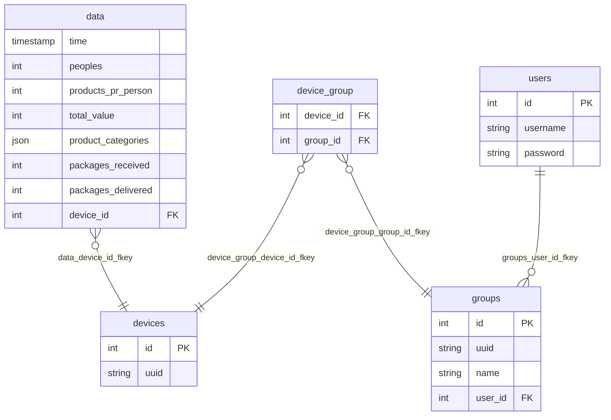

**Title**: StoreMetrics

**Participants**: Kasper R, Kasper K & Jonas N.

# Specs

1. **Project Description:**
    We want to create a system to collect data from physical stores. The data we are interested in collecting are:
    - How many people have entered the store
    - How many products have been sold
    - What types of products have been sold
    - The total value of sold products
    - How many packages have been picked up and delivered to the store if the store has a package delivery spot

    The purpose is to collect data from stores and display it in an intuitive way where a user can filter and search the data.

2. **Domain Model:**
    - IoT devices: Collect data continuously and send it every minute.
    - Server: Runs an nginx web server that directs traffic to a backend written in PHP using the Laravel framework.
    - Backend: Receives data through a message broker and stores it in a MariaDB SQL server.
    - Frontend: Uses Laravel blade templates to display data.
    ```mermaid
    graph LR;
    E[Frontend] --- C
    A[IoT]-->B[Message broker]
    B-->C[Backend]
    C-->D[(Database)]
    A-- HTTP One time (on startup) ---C
    ```

3. **Functional Requirements:**
    - IoT devices must display an ID on a display, which can be used to filter the data.
    - IoT devices must only use HTTP for the initial communication to get a UUID.
    - IoT devices must be able to collect and send data continuously.
    - The server must be able to receive and store data from IoT devices.
    - The frontend must be able to display the collected data.
    - The frontend must have an admin page:
        - Login + logout.
        - Where you can see a list of devices.
        - Where you can group devices as a single unit.
        - Manage devices + grouped devices.
    - Data display must include filtering and searching options.
    - All data must be accessible to everyone.
    - CI/CD Deployment.

4. **Non-functional Requirements:**
    - Usability: The user interface must be intuitive and easy to navigate.
    - Reliability: The system must have an uptime of 99.9%.
    - Performance: The system must handle up to 1000 concurrent devices.
    - Supportability: The code must be well-documented and easy to maintain.

5. **Limitations:**
    - Data predictions
    - Data pagination
    - Data export to csv

# Database


# User guide


# Dev setup guide
